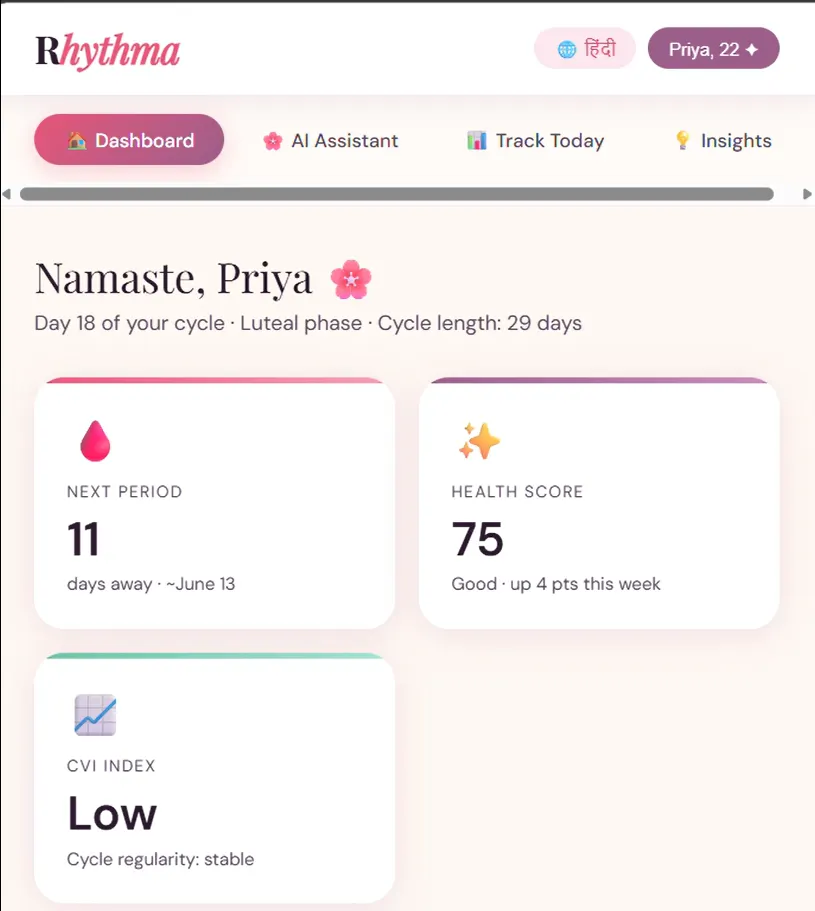

# Rhythma AI

> AI for Every Phase of Her Health

## Project Description

Rhythma AI is a multilingual, AI-powered women's health companion designed specifically for Indian women. The platform aims to improve menstrual health awareness through personalized insights, conversational AI, and accessible health education.

Unlike traditional period-tracking applications, Rhythma is built with the realities of Tier-2 and Tier-3 India in mind, supporting regional languages, offline-first functionality, and privacy-focused health tracking.

The platform enables users to:

* Track menstrual cycles, symptoms, mood, sleep, and lifestyle habits
* Receive personalized menstrual health insights
* Interact with a multilingual AI health assistant powered by Gemini
* Access menstrual health guidance in their preferred language
* Continue using core features even with limited internet connectivity
* Receive health summaries through SMS-based notifications

### Key Features

* 🌸 Menstrual Health Tracking
* 🤖 Gemini-Powered Multilingual AI Assistant
* 📊 Cycle Variability Index (CVI)
* ❤️ Menstrual Health Score (MHS)
* 📱 Offline-First Architecture
* 🔒 Privacy-First Design with Local Encryption
* 🌍 Support for Indian Regional Languages
* 📩 SMS Health Summaries

### Technology Stack

| Technology          | Purpose                           |
| ------------------- | --------------------------------- |
| Flutter             | Cross-platform mobile application |
| FastAPI             | Backend APIs and services         |
| Gemini API          | Conversational AI assistant       |
| Google Firestore    | Cloud synchronization             |
| Hive                | Local offline storage             |
| Twilio              | SMS notifications                 |
| XGBoost             | Health pattern analysis           |
| Logistic Regression | Health score generation           |
| AES-256 Encryption  | Data security                     |

---

# Repository Structure

```text
Rhythma/
│
├── frontend/
│   ├── screens/
│   ├── widgets/
│   ├── services/
│   └── assets/
│
├── backend/
│   ├── api/
│   ├── models/
│   ├── services/
│   └── utils/
│
├── data/
│   └── sample_datasets/
│
├── docs/
│   └── architecture.md
│
├── screenshots/
│   ├── home.png
│   ├── onboarding.png
│   ├── chatbot.png
│   ├── tracker.png
│   ├── dashboard.png
│   ├── insights.png
│   ├── multilingual.png
│   └── settings.png
│
├── README.md
├── LICENSE
├── CONTRIBUTING.md
├── requirements.txt
└── .gitignore
```

---

# Setup / Installation Instructions

## Prerequisites

Before running the project, ensure you have:

* Flutter SDK
* Python 3.10+
* Git
* Firebase Account
* Gemini API Key
* Twilio Account (Optional)

---

## Clone Repository

```bash
git clone https://github.com/ishita2740/Rhythma.git

cd Rhythma
```

---

## Backend Setup

Navigate to backend directory:

```bash
cd backend
```

Create virtual environment:

```bash
python -m venv venv
```

Activate virtual environment:

### Windows

```bash
venv\Scripts\activate
```

### Linux / macOS

```bash
source venv/bin/activate
```

Install dependencies:

```bash
pip install -r requirements.txt
```

Configure environment variables:

```env
GEMINI_API_KEY=your_api_key
FIREBASE_PROJECT_ID=your_project_id
TWILIO_ACCOUNT_SID=your_sid
TWILIO_AUTH_TOKEN=your_token
```

Run FastAPI server:

```bash
uvicorn main:app --reload
```

---

## Frontend Setup

Navigate to frontend directory:

```bash
cd frontend
```

Install Flutter packages:

```bash
flutter pub get
```

Run application:

```bash
flutter run
```

---

## 📸 Screenshots

### Home Screen


### User Onboarding


### AI Health Assistant


### Cycle Tracker


### Health Dashboard



### Personalized Insights


### Multilingual Support


### Settings & Preferences


---

## 📖 Project Story

Learn more about the inspiration and development journey behind Rhythma AI:

🔗 **Medium Article:**
https://medium.com/@rathiishita1005729/building-rhythma-an-ai-health-companion-for-the-women-indias-apps-forgot-e249ac1cdc9a

This article explains the problem, architecture, design decisions, and vision behind the project.

---

## Disclaimer

Rhythma AI is intended for educational and preventive health awareness purposes only. It is not a medical device and does not provide diagnoses, prescriptions, or medical treatment recommendations. Users should consult qualified healthcare professionals for medical advice.

---

## License

This project is licensed under the MIT License. See the LICENSE file for details.
